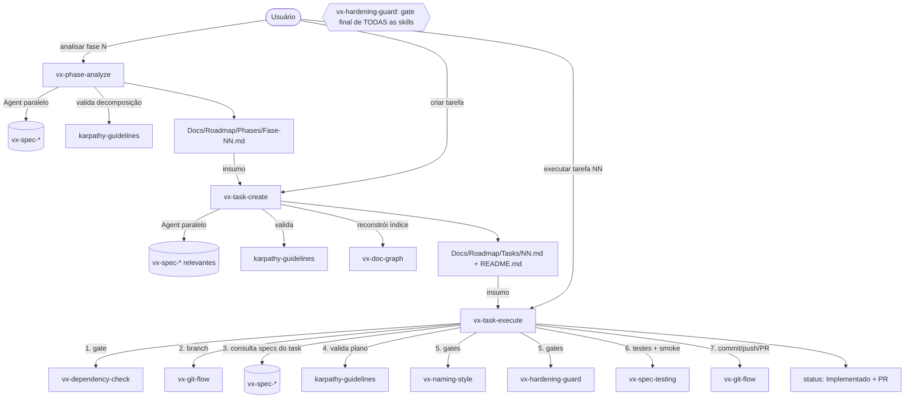

# Vibe Coding Workflow — Fluxo de Execução das Skills

> Documento de referência. Descreve **como** o trabalho flui pelas skills `vx-*` do projeto
> (criar tarefa → executar tarefa → validar tarefa) e **o que** cada skill faz, quem ela chama
> internamente e quais disparam subagentes.
>
> Leitura obrigatória antes de qualquer ação (conforme `CLAUDE.md`):
> 1. [HARDENING.md](../Hardening/HARDENING.md) — regras não-negociáveis.
> 2. [design-mvp.md](../design-mvp.md) — contrato do MVP.
> 3. `CLAUDE.md` (raiz) — regras do projeto.

---

## 1. Contexto e propósito

O projeto opera sob um regime estrito: **nenhuma ação acontece fora de uma skill `vx-*`**.
Programação livre, refatoração oportunista ou limpeza "já que estamos aqui" são proibidas.
Todo trabalho passa por três etapas encadeadas — análise de fase, criação de tarefa,
execução de tarefa — e cada etapa consulta a hardening e o design doc antes de agir.

**Split de modelos (formato 2 — ADR 0013, HARDENING §14):** as etapas de pensamento
(`vx-phase-analyze`, `vx-task-create`) rodam num modelo grande (classe **Opus**); a execução
(`vx-task-execute`) roda num modelo de contexto menor (classe **Sonnet**). Por isso o doc de
task é uma **spec autossuficiente**: os especialistas são consultados na CRIAÇÃO e seus
contratos/planos de teste/comandos são assados no doc — o executor nunca reconsulta
especialistas nem explora o repositório. Norma operacional: criar tasks **just-in-time**
(1–3 à frente da execução), não a fase inteira de uma vez.

Existem **20 skills `vx-*`** instaladas em `.claude/skills/`, organizadas em três camadas.
Toda comunicação flui **para baixo** (orquestrador → suporte/especialista) ou **para fora**
(via Agent / skill externa). Não há chamadas laterais nem circulares: o grafo é um **DAG**.

---

## 2. Arquitetura em três camadas

```
┌─────────────────────────────────────────────────────────────────┐
│  ORQUESTRADORES (3)                                              │
│  vx-phase-analyze · vx-task-create · vx-task-execute            │
│  → coordenam o trabalho, disparam especialistas via Agent       │
└───────────────┬─────────────────────────────┬───────────────────┘
                │ chama (Skill)               │ dispara (Agent, paralelo)
                ▼                             ▼
┌───────────────────────────┐   ┌────────────────────────────────┐
│  SUPORTE (5)              │   │  ESPECIALISTAS (12)            │
│  vx-hardening-guard      │   │  vx-spec-architecture          │
│  vx-naming-style         │   │  vx-spec-rendering             │
│  vx-dependency-check     │   │  vx-spec-shaders               │
│  vx-git-flow             │   │  vx-spec-physics               │
│  vx-doc-graph            │   │  vx-spec-audio                 │
│  → validação / git /     │   │  vx-spec-animation             │
│    índice. NÃO chamam     │   │  vx-spec-gameplay              │
│    ninguém (terminais).   │   │  vx-spec-tools                 │
└───────────────────────────┘   │  vx-spec-memory-perf (CRÍTICO) │
                                │  vx-spec-testing               │
                                │  vx-spec-ui-ux                 │
                                │  vx-spec-workflow (Socrático)  │
                                │  → retornam contratos/recomen- │
                                │    dações. NÃO escrevem código │
                                │    nem chamam outras skills.    │
                                └────────────────────────────────┘
```

**Regra universal:** `vx-hardening-guard` é o **gate terminal** — toda skill `vx-*` deve
chamá-lo como **última verificação** antes de produzir saída. Ele relê a HARDENING.md a cada
chamada (nunca faz cache) e retorna `OK`, `VIOLATION:<regra>` ou `AMBIGUOUS:<regra>`.

---

## 3. Fluxo canônico ponta a ponta



Artefatos gerados em cada etapa:

| Etapa | Skill | Saída |
|---|---|---|
| Análise de fase | `vx-phase-analyze` | `Docs/Roadmap/Phases/Fase-NN-nome.md` |
| Criação de tarefa | `vx-task-create` | `Docs/Roadmap/Tasks/NN-nome.md` + atualiza `README.md` |
| Execução de tarefa | `vx-task-execute` | código + status `Implementado` + branch/commit/PR |

---

## 4. Etapa: Criar tarefa (`vx-task-create`)

Gera um documento de tarefa **autossuficiente (formato 2)** sob `Docs/Roadmap/Tasks/NN-nome.md`
(150–250 linhas, teto 300 — ADR 0013). Todo o pensamento acontece aqui: os especialistas são
consultados NA CRIAÇÃO e seus outputs são assados no doc. A execução não reconsulta ninguém.

Passos:

1. **Verifica o phase doc** — precisa ter as seções formato-2 (`Contratos entre tasks`,
   `Comandos canônicos`, `verificação por máquina`, `Flags de risco`). Faltando → re-rodar
   `vx-phase-analyze`.
2. **Pergunta até zerar ambiguidade** via `AskUserQuestion`. Decisões arquiteturais viram ADR.
3. **Consulta especialistas em paralelo via Agent**, cada um obrigado a devolver o schema
   `CONTRACT / CONTRACT-NOTES / FILES / TESTS / CONSTRAINTS / RISKS / OPEN-QUESTIONS / SPLIT-SIGNAL`.
   Subagentes não têm `AskUserQuestion` — perguntas vivem em `OPEN-QUESTIONS`.
4. **Toda OPEN-QUESTION vira `AskUserQuestion`** antes de escrever o doc; resposta arquitetural
   → ADR primeiro.
5. **Assa o doc**: contratos C++ verbatim, tabela de testes (lista RED), comandos copiados dos
   "Comandos canônicos da fase", `contexto:` (orçamento de leitura ≤ 8 arquivos),
   `files_create`/`files_modify` vinculantes, flags `risco_memoria`/`risco_frame`.
6. **Valida** com `karpathy-guidelines` (caça over-specification).
7. **Auditoria de executor frio** — um subagente recebe SÓ o doc + contexto e lista fatos
   faltantes; gap → corrige e re-audita.
8. **Gate final** com `vx-hardening-guard`; atualiza `Docs/Roadmap/README.md` (via `vx-doc-graph`).

**Dispara agentes?** Sim — `vx-spec-*` em paralelo + 1 auditor frio.

---

## 5. Etapa: Executar tarefa (`vx-task-execute`)

Execução **mecânica** de uma task formato 2 (tipicamente num modelo Sonnet). Para com relatório
estruturado em qualquer contradição — nunca improvisa.

0. **Gate de formato** — `formato: 2` no frontmatter, ou HALT ("rebake via vx-task-create").
1. **Orçamento de leitura** — lê SÓ: o doc da task, `contexto:`, `files_modify:`. Sem
   exploração; fato faltante = Protocolo de bloqueio (HARDENING §14).
2. **Gate de dependências** — `vx-dependency-check`; dep ≠ `Implementado` → PARA.
3. **Pre-flight de contratos** — compara as assinaturas assumidas no doc com os headers reais
   das dependências. Drift → bloqueio.
4. **Bootstrap git** — `git rev-parse --is-inside-work-tree`; sem repo/remote → seção bootstrap
   do `vx-git-flow` (init + `gh repo create` recomendado; local-only exige ADR).
5. **Baseline** — comandos do bloco `## Comandos` VERBATIM; vermelho pré-existente → PARA.
6. **Branch** — `vx-git-flow`: `task/NN-nome`.
7. **Loop `tdd`** sobre a tabela `## Plano de testes` (lista RED, smoke primeiro), implementando
   os `## Contratos` verbatim. **Não há consulta a especialistas em runtime.**
8. **Gate de validação** na sequência exata do doc: build debug+development → ctest filtrado →
   suite completa → smoke `--durations` < 30 s + zero-leak → asan-debug (se `risco_memoria`) →
   `vx-naming-style` → `vx-hardening-guard` → Doxygen. Falha → `diagnose` (2 ciclos máx).
9. **Escalação** — decisão local (≤ 2 opções, nada assado muda) → `AskUserQuestion` +
   `## Desvios aprovados`; mudança de seção assada → relatório estruturado + `Bloqueado` +
   rebake via `vx-task-create`.
10. **Status `Implementado`** → **commit/push/PR** via `vx-git-flow` → relatório final com
    evidência por item do critério.

**Dispara agentes?** Não para especialistas (foram consultados na criação). Apenas as skills
de suporte e os auxiliares `tdd`/`diagnose`.

---

## 6. Etapa: Validar tarefa

A validação não é uma skill única — é um conjunto de gates aplicados ao longo da execução:

| Gate | Skill | Quando | O que faz |
|---|---|---|---|
| Dependências | `vx-dependency-check` | 1º passo da execução | BLOQUEIA se algum dep ≠ `Implementado` |
| Naming/estrutura | `vx-naming-style` | antes do commit | Valida convenções C++/pastas; retorna `OK`/`VIOLATION` |
| Hardening | `vx-hardening-guard` | **gate final de toda skill** | Relê HARDENING.md; `OK`/`VIOLATION`/`AMBIGUOUS` |
| Testes | `vx-spec-testing` | antes do commit | Catch2 + smoke + determinismo; exige suíte verde |
| Decomposição | `karpathy-guidelines` | criação e execução | Reduz erros comuns de LLM (overengineering, suposições) |

---

## 7. Tabela de invocação cruzada

Quem chama quem, por qual método, e **quem dispara subagentes**.

| Chamador | Chamado | Método | Contexto |
|---|---|---|---|
| `vx-phase-analyze` | `vx-spec-*` (relevantes) | **Agent (paralelo)** | Briefing de especialistas para o escopo da fase |
| `vx-phase-analyze` | `karpathy-guidelines` | Skill | Valida qualidade da decomposição |
| `vx-task-create` | `vx-spec-*` (conjunto mínimo) | **Agent (paralelo)** | Consulta breve por contratos/testes/restrições |
| `vx-task-create` | `vx-spec-testing` | sempre | Obrigatório no plano de execução |
| `vx-task-create` | `vx-naming-style`, `vx-hardening-guard`, `vx-git-flow` | sempre | Incluídos no plano de execução |
| `vx-task-create` | `karpathy-guidelines` | Skill | Valida a decomposição da tarefa |
| `vx-task-create` | `vx-doc-graph` | Skill (opcional) | Reconstrói `README.md`/grafo |
| `vx-task-execute` | `vx-dependency-check` | Skill | Gate: deps `Implementado` |
| `vx-task-execute` | `vx-git-flow` | Skill | Bootstrap git, branch, commit, push, PR |
| `vx-task-execute` | ~~`vx-spec-*`~~ | — | **REMOVIDO no formato 2** — contratos já estão assados no doc da task |
| `vx-task-execute` | `tdd` / `diagnose` | Skill (interno) | Lista RED do doc / diagnóstico em falha de gate |
| `vx-task-execute` | `karpathy-guidelines` | Skill | Sanity do outline de implementação |
| `vx-task-execute` | `vx-naming-style` | Skill | Gate antes do commit |
| `vx-task-execute` | `vx-hardening-guard` | Skill | Gate antes do commit |
| **toda `vx-*`** | `vx-hardening-guard` | Skill (implícito) | **Verificação final obrigatória** |

**Quem dispara subagentes (Agent):** apenas os três **orquestradores** — e somente para invocar
`vx-spec-*` em paralelo. As camadas de **suporte** e **especialistas** nunca disparam agentes nem
chamam outras skills (são terminais). Por isso o grafo é um DAG, sem ciclos.

---

## 8. Descrição de cada skill `vx-*`

### Orquestradores (3)

| Skill | Função | Chama internamente | Dispara Agent? |
|---|---|---|---|
| `vx-phase-analyze` | Converte uma fase do `design-mvp.md §9` em doc formato 2 (tecnologias, arquitetura, mapa de arquivos, ordem, riscos, **contratos cross-task, comandos canônicos, verificação por máquina, flags de risco**). | `vx-spec-*`, `karpathy-guidelines`, `vx-hardening-guard` | **Sim** (specs em paralelo, schema obrigatório) |
| `vx-task-create` | Compila doc de tarefa **autossuficiente (formato 2)**: consulta specs na criação, assa contratos/testes/comandos, auditoria de executor frio; atualiza `README.md`. | `vx-spec-*` (criação), `grill-with-docs`, `karpathy-guidelines`, `vx-hardening-guard`, `vx-doc-graph` | **Sim** (specs em paralelo + auditor frio) |
| `vx-task-execute` | Executa a task mecanicamente: gate de formato → orçamento de leitura → deps → pre-flight → baseline → `tdd` sobre a lista RED → gate exato → commit/push/PR. **Sem specs em runtime.** | `vx-dependency-check`, `vx-git-flow`, `tdd`, `diagnose`, `karpathy-guidelines`, `vx-naming-style`, `vx-hardening-guard` | Não (specs foram consultados na criação) |

### Suporte (5) — terminais, não chamam ninguém

| Skill | Função | Chamada por |
|---|---|---|
| `vx-hardening-guard` | Valida a ação contra a HARDENING.md (relê sempre, sem cache). `OK`/`VIOLATION`/`AMBIGUOUS`. | **toda** `vx-*` (gate final) |
| `vx-naming-style` | Valida PascalCase, `m_PascalCase`, prefixo `V`, Public/Private, rename WorldStream, pastas `vx-*`. | `vx-task-execute`, `vx-task-create` |
| `vx-dependency-check` | Lê `dependencies:` da tarefa; BLOQUEIA se algum dep ≠ `Implementado`. | `vx-task-execute` (1º passo) |
| `vx-git-flow` | Branch `task/NN-nome`, commit `[task NN]`, push, PR. Nunca `--no-verify`/`--force`/`--amend` em commit compartilhado. | `vx-task-execute` |
| `vx-doc-graph` | Mantém `Docs/Roadmap/README.md`: tabelas-índice + grafo Mermaid de dependências; consulta subárvore por recurso. | `vx-task-create`, usuário |

### Especialistas (12) — retornam recomendações, não escrevem código nem chamam outras skills

| Skill | Domínio |
|---|---|
| `vx-spec-architecture` | Fronteiras de módulo, Public/Private, contratos de interface, slots multi-backend |
| `vx-spec-rendering` | D3D12 RHI, RenderGraph, GBuffer, deferred/Forward+, CSM, IBL, GTAO, SSR, TAA, FSR |
| `vx-spec-shaders` | HLSL SM 6.6+, DXC, cache DXIL, permutações, root signature, hot reload |
| `vx-spec-physics` | Jolt, `CharacterVirtual`, layers/masks, raycast/sweep/overlap, ragdoll |
| `vx-spec-audio` | miniaudio, emissores 3D, buses, footsteps-by-surface, crossfade de música |
| `vx-spec-animation` | Esqueleto, clips, blend tree, state machine, root motion, notifies, IK two-bone |
| `vx-spec-gameplay` | Character, Combat, AI (1 inimigo), Camera, superfície de SDK de gameplay |
| `vx-spec-tools` | Editor (Dear ImGui), AssetImporter CLI, `TypeRegistry` manual |
| `vx-spec-memory-perf` | **CRÍTICO.** Allocators, D3D12MA, budget de frame (HARDENING §13), segurança de memória (§12), Tracy/PIX, disciplina de cache. Consultado por qualquer coisa per-frame; define as flags `risco_*`. |
| `vx-spec-testing` | Suíte Catch2, smoke, cobertura 100% funcional, determinismo. **Sempre** consultado pelo `vx-task-create`; dono autoritativo da tabela TESTS. |
| `vx-spec-ui-ux` | HUD do jogo em **RmlUi** (.rml/.rcss, data bindings — ADR 0010) + UX do editor em Dear ImGui/ImGuizmo |
| `vx-spec-workflow` | **Socrático.** Desenha pipelines operacionais (setup de personagem, autoria de ataque); **sempre** pergunta via `AskUserQuestion` e registra ADR. |

---

## 9. Skills suplementares instaladas (fora do trilho `vx-*`)

> **Nota:** estas skills foram instaladas a pedido explícito do usuário como ferramentas
> auxiliares (compressão de output, debugging, TDD, etc.). **Não fazem parte** do fluxo
> obrigatório `vx-*` e não substituem nenhum gate da hardening. São instaladas **localmente**
> em `.claude/skills/` — nunca globalmente.

> **Integração:** quatro skills do Matt (`tdd`, `diagnose`, `grill-with-docs`, `to-issues`) estão
> conectadas como sub-passos dos orquestradores `vx-*` (só rodam via `vx-*`). O mapa exato de
> onde cada uma entra e a tradução de convenções estão em
> [MATT-SKILLS-BINDING.md](MATT-SKILLS-BINDING.md).

### Suite Caveman — Julius Brussee (6 skills)

Origem: https://github.com/juliusbrussee/caveman · Foco: compressão de tokens (~65–75%).

| Skill | Função | Dispara Agent? |
|---|---|---|
| `cavecrew` | Guia de decisão para delegar a subagentes caveman; orquestra `cavecrew-investigator` (localizar código), `cavecrew-builder` (edição de 1–2 arquivos), `cavecrew-reviewer` (revisão de diff). | **Sim** (3 subagentes companheiros em `.claude/agents/`) |
| `caveman-commit` | Gerador de mensagem de commit ultra-compacto (Conventional Commits, subject ≤50). | Não |
| `caveman-compress` | Comprime arquivos de memória (CLAUDE.md, todos) para formato caveman; backup `.original.md`. | Não |
| `caveman-help` | Cartão de referência de todos os modos/comandos caveman. | Não |
| `caveman-review` | Comentários de code review ultra-compactos (uma linha por achado). | Não |
| `caveman-stats` | Mostra uso real de tokens da sessão (lê o log do Claude Code). | Não |

> Os 3 agentes companheiros do `cavecrew` ficam em `.claude/agents/`:
> `cavecrew-builder.md`, `cavecrew-investigator.md`, `cavecrew-reviewer.md`.

### Matt Pocock — Engineering (10 skills) + `caveman`

Origem: https://github.com/mattpocock/skills · Foco: workflows de engenharia assistida por IA.

| Skill | Função |
|---|---|
| `diagnose` | Loop disciplinado de diagnóstico: reproduzir → minimizar → hipotetizar → instrumentar → corrigir |
| `grill-with-docs` | Sessão de "grilling" do plano contra o modelo de domínio; atualiza CONTEXT.md/ADRs inline |
| `improve-codebase-architecture` | Acha oportunidades de refatoração usando a linguagem de domínio |
| `prototype` | Constrói protótipo descartável (app de terminal ou variações de UI) antes de commitar um design |
| `setup-matt-pocock-skills` | Scaffold de configuração por repo (issue tracker, labels de triagem) |
| `tdd` | Loop red-green-refactor de TDD |
| `to-issues` | Quebra um plano/spec em issues independentes (tracer-bullet) |
| `to-prd` | Sintetiza a conversa em um PRD publicado no issue tracker |
| `triage` | Roteia issues por uma máquina de estados de triagem |
| `zoom-out` | Pede contexto sistêmico mais amplo ao agente |
| `caveman` | Modo de comunicação ultra-compactado (~75% menos tokens). *Versão do Matt — escolhida na resolução da colisão de nome com a do Julius.* |

> **Colisão de nome resolvida:** ambos os repos têm um skill `caveman`. Por decisão do usuário,
> instalou-se a versão do **Matt Pocock**; a versão homônima do Julius foi **omitida** (os outros
> 6 skills da suite dele foram instalados normalmente).

> **Pós-instalação opcional:** `/setup-matt-pocock-skills` pode ser executado pelo usuário para
> configurar issue tracker e labels. **Não** foi executado automaticamente.

---

## 10. Como as skills foram instaladas

Todas as skills (as 20 `vx-*` e as 17 suplementares) vivem **localmente** no projeto:

```
D:\Dev\vibe-engine\.claude\
    skills\
        vx-*\              (20 skills do workflow do projeto)
        cavecrew\ caveman\ caveman-commit\ caveman-compress\
        caveman-help\ caveman-review\ caveman-stats\          (suite caveman)
        diagnose\ grill-with-docs\ improve-codebase-architecture\
        prototype\ setup-matt-pocock-skills\ tdd\ to-issues\
        to-prd\ triage\ zoom-out\                              (Matt Pocock — engineering)
    agents\
        cavecrew-builder.md  cavecrew-investigator.md  cavecrew-reviewer.md
```

As skills suplementares foram instaladas por **cópia das pastas-folha** (cada uma com seu
`SKILL.md`) clonadas dos repositórios oficiais, com a categorização do repo do Matt **achatada**
para `.claude/skills/<nome>/` (formato que o Claude Code descobre). Nenhuma instalação global
(`~/.claude`) foi feita; os arquivos do projeto (`CLAUDE.md`, `CONTEXT.md`) permaneceram intactos.

**Total: 37 skills no projeto** (20 `vx-*` + 17 suplementares).
