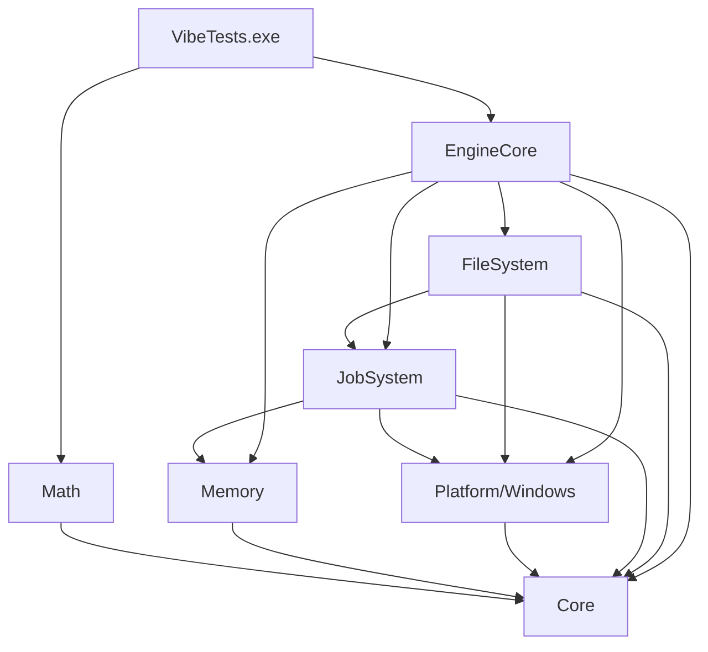

# Fase 01 — Foundation

## Objetivo desta fase

Estabelecer a fundação multiplataforma do runtime: tooling de build, tipos fundamentais do `Core`, camada de abstração de plataforma (Windows-only no MVP), allocators básicos, worker pool de jobs e I/O síncrono + assíncrono. Sem esta fase, nenhuma das fases posteriores compila — `RHI` (Fase 2) precisa de `Platform`, `RenderGraph` (Fase 3) precisa de `Memory`, `Renderer` (Fase 4) precisa de `JobSystem`, e assim por diante.

A fase **não entrega nada visual**. O entregável é um executável de teste de console (`VibeTests.exe`) que, ao rodar, demonstra todos os subsistemas operando coordenadamente. Conforme design-mvp.md §9 Fase 1: "executável de teste roda 8 workers, lê arquivo async, loga via spdlog, todos os testes passam".

A intenção é cumprir o §3 acceptance #10 ("compila do zero em ≤ 30 minutos sem intervenção manual") já ao final desta fase, ainda que o produto final do MVP só feche na Fase 12.

## Critério de aceitação da fase

Extraído de [design-mvp.md §9 Fase 1](../../design-mvp.md), refinado pelas ADRs 0001–0007:

```
[ ] Repositório clonado em máquina nova compila VibeTests.exe via CMakePresets + vcpkg em ≤ 30 min
[ ] 4 presets CMake funcionando: debug, development, shipping, asan-debug
[ ] Catch2 com ≥ 30 testes passando, cobrindo 100% das funcionalidades de Core/Math/Memory/JobSystem/FileSystem/Platform
[ ] VibeTests.exe roda smoke [smoke][fase1] em < 30s, com 8 workers, lê 4 KiB async, loga 32 linhas via spdlog
[ ] Naming validado por vx-naming-style em todos os Public/
[ ] Layout Public/Private respeitado (zero include de Private de outros módulos)
[ ] Doxygen tags presentes em todas as declarações públicas
[ ] TrackingAllocator reporta zero leak no shutdown do smoke (Debug e Development)
[ ] vx-hardening-guard retorna OK
[ ] EngineCore::Initialize/Shutdown executa ordem fixa documentada em ADR 0006
[ ] Tracy client compilado, com pelo menos 4 zonas instrumentadas (JobSystem.Schedule, JobSystem.ParallelFor, FileSystem.ReadAsync, WorkerThread.Run)
```

O módulo `EngineCore` está formalizado no layout §6 do design via ADR 0012 (pendência de governança encerrada).

## Critério de aceitação — verificação por máquina

| Critério | Comando/verificação | Evidência esperada |
|---|---|---|
| 4 presets configuram | `cmake --preset debug` / `development` / `shipping` / `asan-debug` | exit 0 em todos |
| Build limpo | `cmake --build --preset debug` e `--preset development` | exit 0, zero warnings (`/W4 /WX`) |
| ≥ 30 testes verdes | `ctest --preset debug --output-on-failure` | "100% tests passed, 0 tests failed out of ≥30" |
| Smoke da fase < 30 s | `Build\debug\bin\VibeTests.exe "[smoke][fase1]" --durations yes` | duração total impressa < 30 s |
| 8 workers + async + log | saída do smoke `[smoke][fase1]` | "workers: 8", leitura async de 4 KiB OK, 32 linhas logadas |
| Zero leak | saída do smoke (Debug e Development) | "TrackingAllocator: 0 leaks" |
| Tracy instrumentado | inspeção: `VPROFILE_ZONE` em JobSystem/FileSystem/WorkerThread | ≥ 4 zonas presentes |

## Stack confirmada para a fase

| Ferramenta | Versão | Onde é adicionada | Fonte |
|---|---|---|---|
| C++23 | MSVC 2022 | `CMakePresets.json` (`/std:c++latest /Zc:__cplusplus`) | design-mvp.md §4 |
| CMake | ≥ 3.28 | `CMakeLists.txt` raiz, `CMakePresets.json` | design-mvp.md §4 |
| Ninja | última | `CMakePresets.json` (`generator: Ninja`) | design-mvp.md §4 |
| vcpkg | manifest, baseline-locked | `vcpkg.json` + `vcpkg-configuration.json` | design-mvp.md §4, §7 |
| glm | última estável | `vcpkg.json` | design-mvp.md §4, §8.3 |
| spdlog | última estável | `vcpkg.json` — **uso síncrono** | design-mvp.md §4, ADR 0006 |
| tracy | última estável | `vcpkg.json` — client lib + macros, **sem overlay** | design-mvp.md §4, ADR 0004 |
| catch2 | v3 | `vcpkg.json` — `Catch2::Catch2WithMain` | design-mvp.md §4, §7, ADR 0005 |

## Módulos e arquivos previstos

**Convenção de include (ADR 0014)**: headers públicos vivem em `Public/<Module>/Foo.h` e são incluídos como `#include <Module/Foo.h>` (ex.: `Core/Public/Core/Types.h` → `#include <Core/Types.h>`). As árvores abaixo omitem o subdiretório `<Module>/` dentro de `Public/` por brevidade; os `files_create` das tasks trazem os caminhos completos.

```
Engine/Source/Runtime/Core/
    Public/
        Types.h            (Vint8..Vuint64, Vfloat, Vdouble, Vbyte, Vspan, Vstring)
        Assert.h           (VASSERT, VVERIFY, VCHECK)
        Logging.h          (VLOG_INFO, VLOG_WARN, VLOG_ERROR)
        Time.h             (FrameTimer, HighResClock)
        StringId.h         (VStringId)
        Handle.h           (VHandle<T> com generation — ADR 0001)
        Result.h           (VResult alias para std::expected — ADR 0001)
        Profile.h          (VPROFILE_ZONE, VPROFILE_FRAME, no-op em Shipping — ADR 0004)
    Private/
        LoggingSink.cpp
        StringIdTable.cpp
        TimeImpl.cpp
    Tests/
        Core_Types.cpp, Core_Handle.cpp, Core_Result.cpp, Core_StringId.cpp,
        Core_Assert.cpp, Core_Logging.cpp

Engine/Source/Runtime/Math/
    Public/
        Vec2.h, Vec3.h, Vec4.h, Mat4.h, Quat.h, Transform.h, MathCommon.h
    Tests/
        Math_Mat4_Identity.cpp, Math_Quat_Normalize.cpp, Math_Common_Lerp.cpp

Engine/Source/Runtime/Memory/
    Public/
        MemoryTag.h        (enum class fechado — ADR 0001)
        IAllocator.h
        LinearAllocator.h
        FrameAllocator.h   (per-thread — ADR 0003)
    Private/
        LinearAllocatorImpl.cpp
        FrameAllocatorImpl.cpp
        TrackingAllocator.cpp  (Debug+Development — ADR 0003)
        MemoryTagRegistry.cpp
    Tests/
        Memory_Linear_AllocAlignReset.cpp, Memory_Linear_OOM.cpp,
        Memory_Frame_RolloverPerFrame.cpp, Memory_Tag_AggregateByCategory.cpp

Engine/Source/Runtime/Platform/
    Public/
        PlatformApplication.h
        PlatformFile.h
        PlatformThread.h
        PlatformPerformanceCounter.h
    Private/Windows/
        WindowsApplication.cpp/.h
        WindowsFile.cpp/.h
        WindowsThread.cpp/.h
        WindowsPerformanceCounter.cpp
    Tests/
        Platform_App_InitShutdown.cpp, Platform_File_OpenReadCloseSync.cpp,
        Platform_Thread_SetNameVisibleInDebugger.cpp,
        Platform_PerfCounter_Monotonic.cpp

Engine/Source/Runtime/JobSystem/
    Public/
        JobSystem.h        (facade)
        JobHandle.h
        JobFence.h
        ParallelFor.h
        TaskGraph.h
    Private/
        WorkerThread.cpp/.h           (sobre PlatformThread — ADR 0002)
        JobQueue.cpp/.h               (work-stealing deque por worker)
        Job.h                         (sizeof == 64, alignas(64) — ADR 0002)
        ParallelForImpl.cpp           (chunks estáticos)
        TaskGraphImpl.cpp
    Tests/
        Job_WorkerPool_SpawnsN.cpp,
        Job_Schedule_RunsOnce.cpp,
        Job_ParallelFor_SumEqualsSerial.cpp,
        Job_TaskGraph_RespectsDependencies.cpp,
        Job_Fence_WaitBlocksUntilCompletion.cpp,
        Job_ParallelFor_NoDataRace.cpp

Engine/Source/Runtime/FileSystem/
    Public/
        FileSystem.h        (facade)
        Path.h
        FileHandle.h
        AsyncReadRequest.h
        FileWatcher.h       (Poll() guard #if VIBE_TESTING — ADR 0005)
    Private/
        FileSystemImpl.cpp
        AsyncReadWorker.cpp
        WindowsFileWatcher.cpp   (ReadDirectoryChangesW)
    Tests/
        FileSystem_ReadSync_SmallFileMatch.cpp,
        FileSystem_ReadAsync_Completes.cpp,
        FileSystem_ReadAsync_CancelBeforeStart.cpp,
        FileSystem_Watcher_DetectsModify.cpp,
        FileSystem_Path_NormalizeSlashes.cpp,
        FileSystem_OpenMissing_ReturnsErr.cpp

Engine/Source/Runtime/EngineCore/
    Public/
        EngineCore.h        (Initialize, Shutdown, EngineCoreConfig — ADR 0006)
    Private/
        EngineCoreImpl.cpp
    Tests/
        EngineCore_Initialize_OrderFixed.cpp,
        EngineCore_Shutdown_ReverseOrder.cpp,
        EngineCore_Smoke_Fase1.cpp   ([smoke][fase1])
```

Arquivos raiz adicionados nesta fase:
```
CMakeLists.txt
CMakePresets.json    (presets: debug, development, shipping, asan-debug)
vcpkg.json
vcpkg-configuration.json
.gitignore
.editorconfig
.clang-format
Scripts/run-tests.ps1
```

## Arquitetura proposta



Interfaces cross-module relevantes (citando §8.X):
- **Platform → Core** (§8.2): retornos via `VResult<T, PlatformError>`, log via `VLOG_*`, tipos via `Vint*`/`Vbyte`/`Vspan`. Nenhum `<windows.h>` vaza em `Platform/Public/`.
- **JobSystem → Platform** (§5.4, ADR 0002): `WorkerThread` cria threads via `PlatformThread::Create/SetName/SetAffinity`. Slot multi-backend preservado.
- **FileSystem → JobSystem** (§9 Fase 1): `AsyncReadRequest` submete um `Job` cujo `Wait()` é wrapper sobre `JobFence::Wait()`.
- **EngineCore orquestra todos** (ADR 0006, ADR 0012): ordem fixa de Initialize/Shutdown.

## Contratos entre tasks

A superfície pública que cada task EXPÕE para suas sucessoras — registro único de contratos cross-task da fase (HARDENING §14). `vx-task-create` copia daqui para os docs de task; qualquer emenda começa AQUI e se propaga (ver Protocolo de revisão de contratos). Somente símbolos consumidos por OUTRAS tasks; superfície interna fica no doc de cada task.

### T01 — cmake-vcpkg-presets
Não expõe símbolos C++. Expõe convenções de build consumidas por todas as tasks (ADR 0008):
presets `debug`/`development`/`shipping`/`asan-debug`; alvos `Vibe<Module>` com alias `Vibe::<Module>`; executáveis em `Build/<preset>/bin/` (`CMAKE_RUNTIME_OUTPUT_DIRECTORY`); defines `VIBE_*` propagados PUBLIC.
Consumido por: T02–T14.

### T02 — core-types-handles-result
Expõe (`Engine/Source/Runtime/Core/Public/`):
```cpp
namespace VibeEngine {
using Vint8 = std::int8_t;   using Vuint8  = std::uint8_t;   // ... até Vint64/Vuint64
using Vfloat = float;        using Vdouble = double;         using Vbyte = std::byte;
template <typename T> using Vspan = std::span<T>;
using Vstring = std::string;                                  // ADR 0001
template <typename T, typename E> using VResult = std::expected<T, E>;  // ADR 0001
template <typename T> class VHandle; // 8 B: m_Index + m_Generation (Vuint32); Invalid(), Index(), Generation(), IsValid(), operator== (ADR 0001)
class VStringId;              // FNV-1a 64-bit sem seed; Value(), DebugString(); operator""_sid (ADR 0009)
}
#define VASSERT(Expr, ...)    // no-op em Shipping; handler de teste via VASSERT_SetHandlerForTesting (ADR 0009)
#define VVERIFY(Expr, ...)    // mantém avaliação em Shipping
#define VCHECK(Expr, ...)     // ativo em todos os builds
```
Consumido por: T03–T14 (todas).

### T03 — core-logging-time-profile
Expõe (`Engine/Source/Runtime/Core/Public/`):
```cpp
#define VLOG_INFO(...)  /* spdlog síncrono; ((void)0) em Shipping (ADR 0006) */
#define VLOG_WARN(...)
#define VLOG_ERROR(...)
namespace VibeEngine {
class HighResClock;   // static Vuint64 NowTicks(); static Vdouble TicksToSeconds(Vuint64)
class FrameTimer;     // void Tick(); Vdouble DeltaSeconds() const; Vuint64 FrameIndex() const
}
#define VPROFILE_ZONE(Name)   // Tracy; no-op sem TRACY_ENABLE (ADR 0004)
#define VPROFILE_FRAME()
#define VPROFILE_PLOT(Name, Value)
```
Consumido por: T05–T14.

### T05/T06 — memory
Expõe (`Engine/Source/Runtime/Memory/Public/`):
```cpp
namespace VibeEngine {
enum class MemoryTag : Vuint16 { Core, Job, FileSystem, Frame, Debug /* fechado — ADR 0001 */ };
class IAllocator;       // Allocate(Size, Align, Tag), Free(Ptr) — interface
class LinearAllocator;  // : IAllocator
class FrameAllocator;   // per-thread, Reset() por frame (ADR 0003)
}
```
Consumido por: T09, T10, T13.

### T07 — platform-windows-base
Expõe (`Engine/Source/Runtime/Platform/Public/`):
```cpp
namespace VibeEngine {
class PlatformFile;               // Open/Read/Close síncronos; VResult<..., PlatformError>
class PlatformThread;             // Create(Fn, Name), SetName, SetAffinity, Join (ADR 0002)
class PlatformPerformanceCounter; // static Vuint64 Now(); static Vuint64 Frequency()
}
```
Consumido por: T08, T09, T11, T13.

### T09/T10 — jobsystem
Expõe (`Engine/Source/Runtime/JobSystem/Public/`):
```cpp
namespace VibeEngine {
struct JobHandle;                       // opaco
class JobSystem;                        // static Schedule(Job) -> JobHandle; Job 64 B alinhado, payload inline 48 B (ADR 0002)
class JobFence;                         // void Wait()
void ParallelFor(Vuint32 Count, Vuint32 ChunkSize, /*callable*/ ...);
class TaskGraph;                        // AddNode, AddDependency, Submit() -> JobFence
}
```
Consumido por: T12, T13, T14.

### T11/T12 — filesystem
Expõe (`Engine/Source/Runtime/FileSystem/Public/`):
```cpp
namespace VibeEngine {
class Path;             // NormalizeSlashes, Join, Extension
class FileSystem;       // static ReadSync(Path) -> VResult<std::vector<Vbyte>, FileError>; ReadAsync(Path) -> AsyncReadRequest
class AsyncReadRequest; // Wait(); Result() -> VResult<...>  (wrapper sobre JobFence)
class FileWatcher;      // Watch(Path, Callback); Poll() apenas com VIBE_TESTING (ADR 0005)
}
```
Consumido por: T13, T14.

### T13 — engine-core-bootstrap
Expõe (`Engine/Source/Runtime/EngineCore/Public/`):
```cpp
namespace VibeEngine {
struct EngineCoreConfig { Vuint32 m_WorkerCount{0}; Vuint64 m_FrameAllocatorSize{0}; bool m_EnableTracking{true}; }; // ADR 0006
VResult<void, EngineError> Initialize(const EngineCoreConfig& Config); // ordem fixa; EngineError::InsufficientHardware se < 8 cores (ADR 0007)
void Shutdown();                                                       // ordem inversa
}
```
Consumido por: T14.

## Comandos canônicos da fase

Bloco único — tasks copiam DAQUI. Preset/caminho mudou → atualizar aqui primeiro, depois rebake das tasks ainda `Planejado` (HARDENING §14). Status: **previsto** (vira **verificado** quando a T01 aterrissar e os caminhos forem confirmados).

```powershell
# Configurar (uma vez por preset)
cmake --preset debug
cmake --preset development

# Build (gate: /W4 /WX falham com warning novo — ADR 0008)
cmake --build --preset debug
cmake --build --preset development

# Suite completa
ctest --preset debug --output-on-failure
ctest --preset development --output-on-failure

# Smoke da fase (com medição de duração)
Build\debug\bin\VibeTests.exe "[smoke][fase1]" --durations yes

# Variantes por task (o doc da task define o filtro -R e as tags; a forma é esta):
ctest --preset debug --output-on-failure -R "<FiltroDaTask>"
Build\debug\bin\VibeTests.exe "[smoke][<modulo>]" --durations yes

# Gate de memória (apenas tasks com risco_memoria: true — HARDENING §12)
cmake --preset asan-debug
cmake --build --preset asan-debug
ctest --preset asan-debug --output-on-failure
```

## Ordem interna de implementação

Os passos abaixo viram um conjunto de tasks via `vx-task-create` (esboço em "Tasks previstas"):

1. **Setup CMake/vcpkg/presets** — `CMakeLists.txt` raiz, `CMakePresets.json` com 4 presets, `vcpkg.json` baseline-locked, `.gitignore`, `.editorconfig`, `.clang-format`. Critério: `cmake --preset debug && cmake --build --preset debug` produz binário vazio.
2. **Core** — Types → Assert → Logging (síncrono) → Time → StringId → Handle (8 B com generation) → Result (alias `std::expected`) → Profile (macros Tracy). Critério: testes [core] passam.
3. **Math** — wrappers triviais sobre glm. Critério: 3 testes [math] passam.
4. **Memory** — `MemoryTag` enum → `IAllocator` → `LinearAllocator` → `FrameAllocator` (per-thread) → `TrackingAllocator` (wrapper Debug+Development). Critério: 4 testes [memory] passam, smoke do tracking reporta zero leak.
5. **Platform/Windows** — interfaces Public primeiro; depois Windows backend de `File` → `Thread` → `PerformanceCounter` → `Application`. Critério: 4 testes [platform] passam.
6. **JobSystem** — `WorkerThread` (sobre PlatformThread) → `Job` (64 B aligned, ADR 0002) → `JobQueue` (work-stealing deque com head/tail em cache lines separadas) → `JobHandle` → `JobFence` → `ParallelFor` (chunks estáticos) → `TaskGraph` (predecessors atomic). Critério: 6 testes [job] passam, sem flakiness em 100 execuções consecutivas.
7. **FileSystem** — `Path` → `FileHandle` síncrono (via PlatformFile) → `AsyncReadRequest` (via JobSystem) → `FileWatcher` (ReadDirectoryChangesW) com `Poll()` guard `#if VIBE_TESTING`. Critério: 6 testes [filesystem] passam.
8. **EngineCore::Initialize/Shutdown** — orquestrador central com ordem fixa (ADR 0006). Critério: 2 testes de ordem passam.
9. **VibeTests.exe + smoke global** — alvo CMake único, `catch_discover_tests()`, `Scripts/run-tests.ps1`. `EngineCore_Smoke_Fase1.cpp` reproduz literalmente o critério §9 Fase 1. Critério: smoke roda em < 5 s; total da suite ≤ 60 s.

## Tasks previstas (esboço)

```
01-cmake-vcpkg-presets             — Setup de build (CMake + Ninja + vcpkg + 4 presets)
02-core-types-handles-result       — Core: Types, Handle, Result, StringId, Assert
03-core-logging-time-profile       — Core: Logging síncrono, Time, Profile (Tracy macros)
04-math-wrappers-glm               — Math wrappers finos sobre glm
05-memory-tag-allocators           — MemoryTag, IAllocator, LinearAllocator
06-memory-frame-tracking           — FrameAllocator per-thread + TrackingAllocator
07-platform-windows-base           — Platform: File, Thread, PerformanceCounter (Public + Windows backend)
08-platform-windows-application    — Platform: Application (loop, lifetime)
09-jobsystem-worker-queue          — JobSystem: WorkerThread, Job 64B, JobQueue work-stealing
10-jobsystem-graph-parallelfor     — JobSystem: TaskGraph, ParallelFor, JobFence
11-filesystem-sync-path            — FileSystem: Path, FileHandle síncrono
12-filesystem-async-watcher        — FileSystem: AsyncReadRequest + FileWatcher
13-engine-core-bootstrap           — EngineCore::Initialize/Shutdown com ordem fixa
14-vibetests-exe-smoke-fase1       — VibeTests.exe + smoke global da Fase 1
```

Cada uma vai a `vx-task-create` para virar `Docs/Roadmap/Tasks/NN-nome.md` no **formato 2** (ADR 0013): especialistas são consultados na CRIAÇÃO e seus contratos assados no doc; a execução é mecânica. Norma operacional: criar 1–3 tasks à frente da execução, não as 14 de uma vez (HARDENING §14).

## Flags de risco por task

Fonte: recomendação do `vx-spec-memory-perf` (HARDENING §12/§13). `vx-task-create` copia para o frontmatter.

| Task | risco_memoria | risco_frame | Gate extra |
|---|---|---|---|
| 01-cmake-vcpkg-presets | false | false | — |
| 02-core-types-handles-result | false | false | — |
| 03-core-logging-time-profile | false | false | — |
| 04-math-wrappers-glm | false | false | — |
| 05-memory-tag-allocators | **true** | false | asan-debug + zero-leak |
| 06-memory-frame-tracking | **true** | false | asan-debug + zero-leak |
| 07-platform-windows-base | **true** | false | asan-debug (handles Win32, buffers) |
| 08-platform-windows-application | false | false | — |
| 09-jobsystem-worker-queue | **true** | **true** | asan-debug + teste [perf] (deque work-stealing) |
| 10-jobsystem-graph-parallelfor | **true** | **true** | asan-debug + teste [perf] (ParallelFor escala — §11) |
| 11-filesystem-sync-path | **true** | false | asan-debug (buffers de leitura) |
| 12-filesystem-async-watcher | **true** | false | asan-debug (OVERLAPPED, lifetime de request) |
| 13-engine-core-bootstrap | false | false | — (smoke já cobre zero-leak global) |
| 14-vibetests-exe-smoke-fase1 | false | false | — |

## Protocolo de revisão de contratos (churn — HARDENING §14)

Quando um Desvio aprovado em execução muda um símbolo de "Contratos entre tasks":

1. Emendar a seção **Contratos entre tasks** desta fase.
2. Listar tasks afetadas via `vx-doc-graph` ("dependentes de NN").
3. Rebake de cada task afetada ainda `Planejado` via `vx-task-create`.
4. Tasks afetadas já `Implementado` → nova task corretiva, nunca edição retroativa.

## Riscos específicos da fase

Referencia design-mvp.md §12 mais riscos levantados pelos especialistas:

| Risco | Mitigação | Origem |
|---|---|---|
| Platform vazando `<windows.h>` em Public | PIMPL ou `void*` typed handle; revisão por `vx-naming-style` em cada PR | vx-spec-architecture |
| `JobQueue` sem padding cache-line → false sharing letal na Fase 4 | `alignas(64)` em head/tail de cada deque desde o início (ADR 0002) | vx-spec-memory-perf |
| `std::function` infiltrado como payload de Job | Compile-time check `sizeof(captures) ≤ 48` (ADR 0002) | vx-spec-memory-perf |
| FileWatcher flaky em CI lento | `Poll()` síncrono guard `#if VIBE_TESTING` (ADR 0005) | vx-spec-testing |
| Logging morrendo antes do JobSystem | Ordem reversa de Shutdown fixada (ADR 0006) | vx-spec-architecture |
| `TrackingAllocator` sub-relatando (não cobre `new` global) | Aceito — opt-in via allocators da engine (ADR 0003) | vx-spec-memory-perf |
| Tracy só ativado na Fase 3 → retrofit cross-cutting | Integrado já agora (ADR 0004) | vx-spec-memory-perf |
| `glm` exposto em headers Public — troca futura cara | Typedefs com prefixo V; operações via funções livres em `VibeEngine::Math` | vx-spec-architecture |
| HW menor que 8 cores físicos → smoke falha startup | Mensagem clara apontando ADR 0007 + override `EngineCoreConfig::m_WorkerCount` | vx-spec-memory-perf |

## Hardening relevante

Aplicam-se com força nesta fase:

- **§1 Escopo do MVP**: nada fora da lista in-scope. `Window` e `DynamicLibrary` saem do Platform desta fase (não há cliente in-scope da Fase 1).
- **§2 Lista negativa**: nenhum item da lista é tocado. Plugin system (motivação clássica para `MemoryTag` aberto e `DynamicLibrary`) está banido — ADR 0001 e remoção de DL refletem isso.
- **§3 Nomenclatura**: V-prefix em todos os tipos fundamentais; `m_PascalCase` em membros; `PascalCase` em funções/classes/arquivos; `VLOG_*`/`VASSERT` em SCREAMING_SNAKE.
- **§4 Public/Private**: cada módulo expõe apenas Public; testes em pasta `Tests/` separada.
- **§5 Doxygen**: obrigatório em toda declaração Public dos 6 módulos.
- **§7 Testes**: ≥ 30 testes Catch2 (excede o piso §9 de 20+) cobrindo 100% das funcionalidades; smoke < 30 s; determinístico (zero `sleep_for`, zero RNG sem seed); fixtures isolados; tags por módulo.
- **§8 Regra de decisão**: ADRs 0001–0009 + 0011–0013 cobrem as escolhas arquiteturais e de processo da fase. Qualquer nova escolha vira ADR antes da task.
- **§10 Critério de tarefa pronta**: cada uma das 14 tasks previstas deverá satisfazer integralmente a checklist do §10 (incluindo os itens novos de §12/§13/§14).
- **§12 Segurança de memória**: RAII em tudo; allocators com `MemoryTag`; zero leaks no smoke; asan-debug nas tasks flagadas (ver Flags de risco por task).
- **§13 Orçamento de performance**: Tracy zones desde a T03 (ADR 0004); testes `[perf]` nas tasks de JobSystem (T09/T10 — "ParallelFor escala em throughput", §11).
- **§14 Contrato de execução (formato 2)**: todas as tasks desta fase são criadas no formato 2; tasks v1 antigas exigem rebake antes de executar.

## Perguntas em aberto

Nenhuma. Todas as 14 decisões surfacing surgidas dos especialistas foram respondidas pelo usuário e registradas em ADRs 0001–0007 (e ajustes Karpathy aceitos: 4 presets em vez de 6, spdlog síncrono em vez de async, Platform reduzido, Math com 3 testes).

A fase está pronta para ser desdobrada em tasks via `vx-task-create`.
