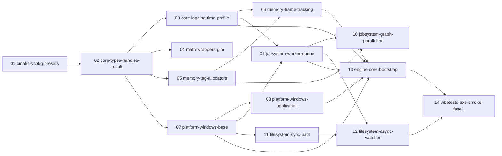

# Vibe Engine — Roadmap

Índice rápido de fases e tarefas. Consulta primária para qualquer skill `vx-*` antes de iniciar trabalho.

Fonte de verdade do escopo: [design-mvp.md](../design-mvp.md). Regras inegociáveis: [Hardening/HARDENING.md](../Hardening/HARDENING.md).

## Fases

| ID | Nome | Status | Doc |
|----|------|--------|-----|
| 01 | foundation | Analisada | [Fase-01-foundation.md](Phases/Fase-01-foundation.md) |
| 02 | rhi-d3d12 | Não-iniciada | — |
| 03 | rendergraph-imgui | Não-iniciada | — |
| 04 | renderer-realista | Não-iniciada | — |
| 05 | asset-system | Não-iniciada | — |
| 06 | world-ecs-scene | Não-iniciada | — |
| 07 | animation-character | Não-iniciada | — |
| 08 | physics-jolt | Não-iniciada | — |
| 09 | combat-ai | Não-iniciada | — |
| 10 | audio | Não-iniciada | — |
| 11 | editor | Não-iniciada | — |
| 12 | game-polish | Não-iniciada | — |

## Tarefas

| ID | Nome | Fase | Status | Dependências |
|----|------|------|--------|--------------|
| 01 | cmake-vcpkg-presets | Fase-01-foundation | Implementado | — |
| 02 | core-types-handles-result | Fase-01-foundation | Implementado | 01 |
| 03 | core-logging-time-profile | Fase-01-foundation | Implementado | 02 |
| 04 | math-wrappers-glm | Fase-01-foundation | Planejado | 02 |
| 05 | memory-tag-allocators | Fase-01-foundation | Planejado | 02 |
| 06 | memory-frame-tracking | Fase-01-foundation | Planejado | 03, 05 |
| 07 | platform-windows-base | Fase-01-foundation | Planejado | 02 |
| 08 | platform-windows-application | Fase-01-foundation | Planejado | 07 |
| 09 | jobsystem-worker-queue | Fase-01-foundation | Planejado | 03, 07 |
| 10 | jobsystem-graph-parallelfor | Fase-01-foundation | Planejado | 05, 09 |
| 11 | filesystem-sync-path | Fase-01-foundation | Planejado | 07 |
| 12 | filesystem-async-watcher | Fase-01-foundation | Planejado | 09, 11 |
| 13 | engine-core-bootstrap | Fase-01-foundation | Planejado | 03, 06, 07, 08, 09 |
| 14 | vibetests-exe-smoke-fase1 | Fase-01-foundation | Planejado | 12, 13 |

## Grafo de dependências entre tarefas

## ADRs ativas

| ID | Título | Status |
|----|--------|--------|
| 0001 | [Tipos fundamentais do módulo Core](../Decisions/0001-tipos-fundamentais-core.md) | Aceita |
| 0002 | [JobSystem worker pool — backend de thread e payload](../Decisions/0002-jobsystem-worker-pool.md) | Aceita |
| 0003 | [Allocators da Fase 1 e diagnóstico de memória](../Decisions/0003-allocators-e-diagnostico.md) | Aceita |
| 0004 | [Integrar Tracy já na Fase 1](../Decisions/0004-tracy-na-fase-1.md) | Aceita |
| 0005 | [Infraestrutura de testes — VibeTests.exe único, FileWatcher.Poll](../Decisions/0005-infra-de-testes.md) | Aceita |
| 0006 | [EngineCore::Initialize centralizado com ordem fixa](../Decisions/0006-bootstrap-centralizado.md) | Aceita |
| 0007 | [Hardware mínimo de execução — 8 núcleos físicos](../Decisions/0007-hw-minimo-execucao.md) | Aceita |
| 0008 | [Convenções de tooling e flags de build por preset](../Decisions/0008-tooling-build-conventions.md) | Aceita |
| 0009 | [Testabilidade de VASSERT e hash determinístico de VStringId](../Decisions/0009-vassert-test-handler-e-stringid-seed.md) | Aceita |
| 0010 | [RmlUi para a HUD do jogo no MVP (editor permanece Dear ImGui)](../Decisions/0010-rmlui-hud-do-jogo.md) | Aceita |
| 0011 | [Metas de performance — gate 1080p@60 e teto de design 4K@60 via FSR](../Decisions/0011-metas-de-performance.md) | Aceita |
| 0012 | [EngineCore como módulo próprio no layout §6](../Decisions/0012-enginecore-modulo-layout.md) | Aceita |
| 0013 | [Formato de task v2 — spec autossuficiente; Opus cria, Sonnet executa](../Decisions/0013-formato-task-v2.md) | Aceita |
| 0014 | [Convenção de include paths — Public/<Module>/ e #include <Module/Foo.h>](../Decisions/0014-convencao-include-paths.md) | Aceita |
| 0015 | [CMAKE_BUILD_TYPE por preset + neutralização de flags default do MSVC](../Decisions/0015-cmake-build-type-por-preset.md) | Aceita |
| 0016 | [Agregação de fontes de teste do VibeTests por glob](../Decisions/0016-test-sources-glob.md) | Aceita |
| 0017 | [Convenções do módulo Math — INTERFACE, typedefs no root, free functions](../Decisions/0017-math-module-conventions.md) | Aceita |
| 0018 | [JobSystem — API pública, ciclo de vida e fronteira T09/T10](../Decisions/0018-jobsystem-api-ciclo-de-vida.md) | Aceita |
| 0019 | [Política de testes de concorrência e [perf] do JobSystem](../Decisions/0019-testes-concorrencia-perf-jobsystem.md) | Aceita |
| 0020 | [FileSystem — formas de leitura e modelo de entrega do FileWatcher](../Decisions/0020-filesystem-leitura-e-watcher.md) | Aceita |
| 0021 | [EngineCore bootstrap — ciclo de vida, detecção de HW e topologia de allocators](../Decisions/0021-enginecore-bootstrap-decisoes.md) | Aceita |

## Pendências de governança

- Nenhuma. A pendência sobre o módulo `EngineCore` (não enumerado em `design-mvp.md §6`) foi **resolvida pela ADR 0012**: `EngineCore` é módulo próprio e o §6 foi emendado.

## Formato das tasks

Todas as tasks deste roadmap seguem o **formato 2** (ADR 0013, HARDENING §14): doc autossuficiente com contratos, plano de testes (lista RED), comandos exatos e orçamento de leitura. `vx-task-execute` recusa docs sem `formato: 2` no frontmatter. Tasks 01–08 já estão no formato 2.

## Como esta página é atualizada

Toda task criada por `vx-task-create` atualiza a tabela "Tarefas" e o grafo Mermaid. `vx-doc-graph` pode rebuildar tudo deterministicamente a partir dos frontmatters de `Tasks/*.md` e `Phases/*.md` (v2: `files_create`+`files_modify`; v1 legado: `files_touch`).
